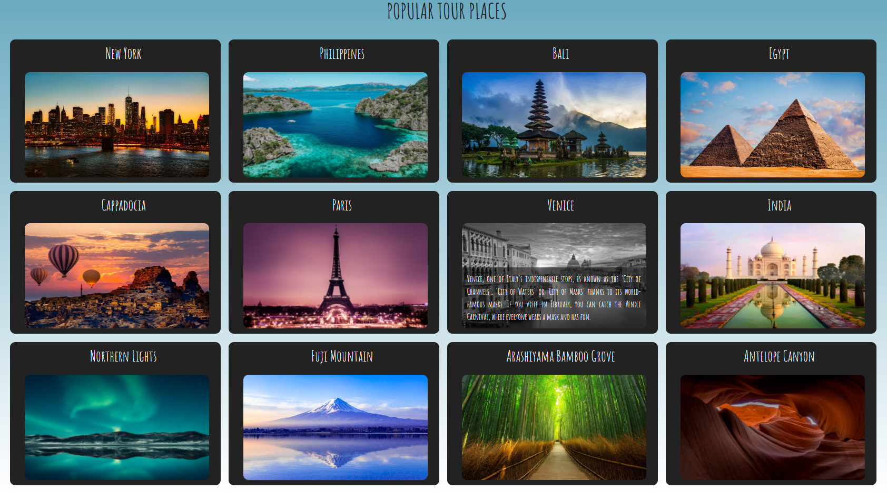

## Available Scripts

In the project directory, you can run:

### `npm install`
### `npm start`

# React Tour Places

## Welcome! 👋

Thanks to visit my Github! In this project, i used flexbox. This project is created with React and pure CSS. Here is the link for this project (https://omer-cicek.github.io/react_tour_places_project/)

**To do this project, i used basic React and CSS.**

## The challenge

Users should be able to:

- View the optimal layout for the site depending on their device's screen size
- See text with good effects while mouse hovered on image

## Got feedback for me?

Feedbacks are always improve my technical knowledge, so feel free to give me a feedback through my LinkedIn account (https://www.linkedin.com/in/omercicek97/) 🙌

**That Is What I Did!** 🚀
